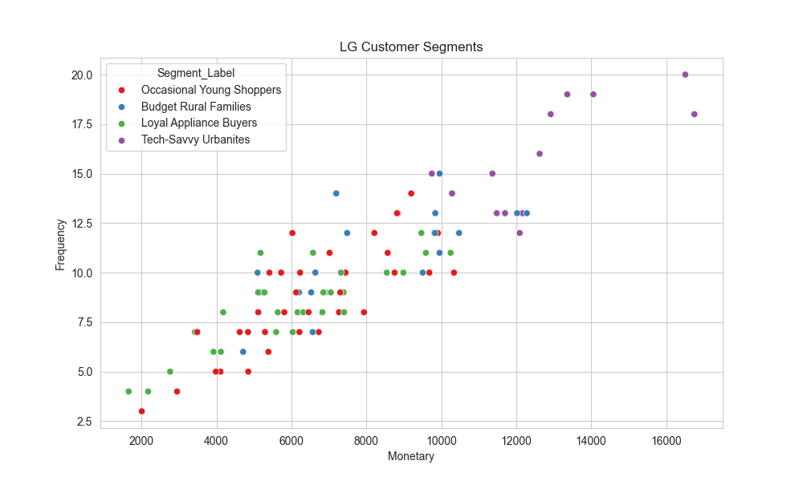
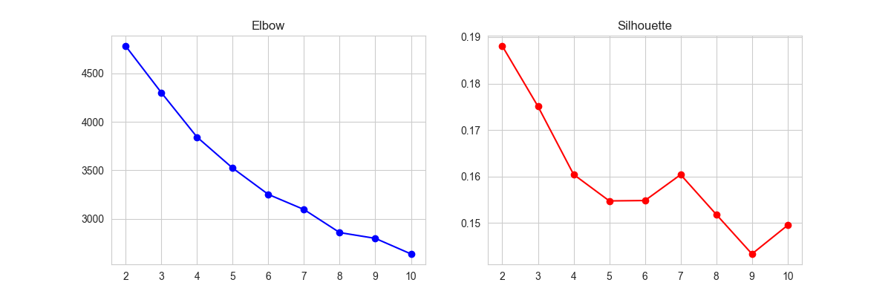
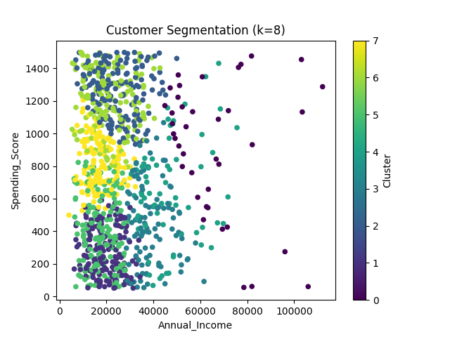

# 📊 Customer Segmentation at LG Corporation

**Author:** Osazuwa Stanley Omoregbe  
**Course:** Business Analytics Final Project – Nexford University  
**Deployment:** 🌍 [Live on Render](https://lg-final-projects.onrender.com)  
_(AWS deployment attempt unsuccessful, so Render was used for hosting)_

---

## 🔑 Executive Summary

This project applies **data-driven customer segmentation** to LG Corporation’s customer base, using clustering techniques to uncover distinct behavioral groups. By analyzing **age, annual income, and spending score**, the model identifies high-value customers, disengaged segments, and premium buyers. The insights enable LG to **personalize marketing strategies, improve retention, and maximize ROI**. The solution is deployed as an **interactive dashboard** on Render, making the analysis accessible and actionable.

---

## 📊 Results & Visualizations

### 1. Customer Segments



This scatter plot shows customer clusters based on **Annual Income** and **Spending Score**. Each color represents a distinct segment.

---

### 2. Clustering Evaluation



- **Elbow Method**: Helps determine the optimal number of clusters.
- **Silhouette Score**: Measures cluster quality and separation.

---

### 3. Updated Clusters



This plot shows the segmentation after updating the number of clusters dynamically in the dashboard.

---

## 🚀 Deployment

- **Live App:** [Customer Segmentation Dashboard](https://lg-final-projects.onrender.com)
- **GitHub Repository:** [LG-FINAL-PROJECTS](https://github.com/Osazuwa10/LG-FINAL-PROJECTS)

---

## ▶️ How to Run Locally

1. Clone the repository:
   ```bash
   git clone https://github.com/Osazuwa10/LG-FINAL-PROJECTS.git
   cd LG-FINAL-PROJECTS
   ```

````

2. Create and activate a virtual environment:

   ```bash
   python -m venv venv
   source venv/bin/activate   # On Mac/Linux
   venv\Scripts\activate      # On Windows
   ```

3. Install dependencies:

   ```bash
   pip install -r requirements.txt
   ```

4. Run the Flask app:

   ```bash
   python app.py
   ```

5. Open in browser:
   ```
   http://127.0.0.1:5000
   ```

---

## 📂 Project Structure

```
LG-FINAL-PROJECTS/
│
├── app.py
├── utils.py
├── requirements.txt
├── runtime.txt
├── lg_customer_data.csv
├── plots/
│   ├── segments_plot.png
│   ├── clustering_eval.png
│   ├── updated_clusters.png
│   └── cluster_summary.csv
├── templates/
│   └── index.html
└── CustomerSegmentation.ipynb
```

---

## ✨ Acknowledgements

- Nexford University – Business Analytics Program
- LG Corporation (case study dataset)
- Render for deployment hosting

---
````
